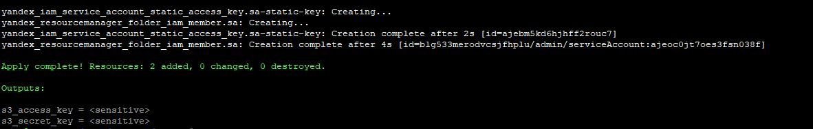
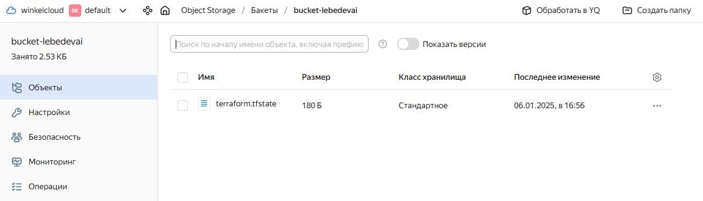
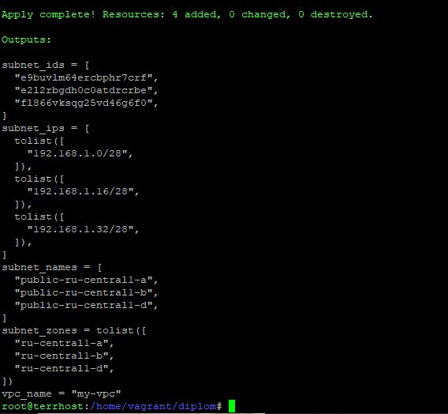
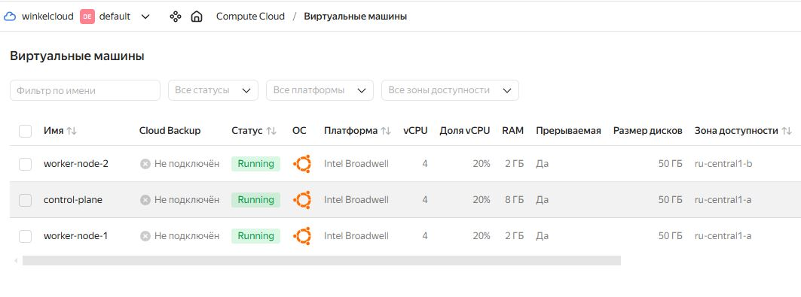
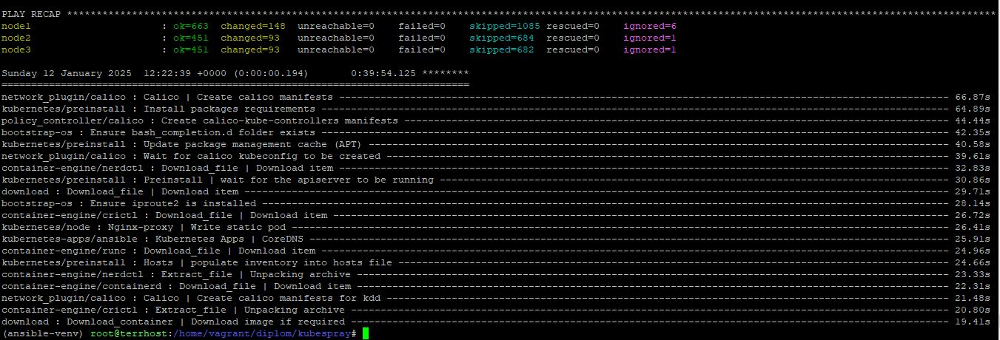
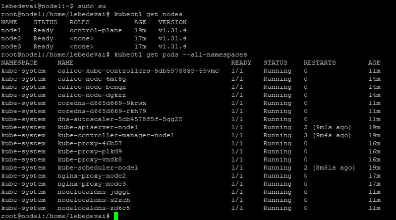
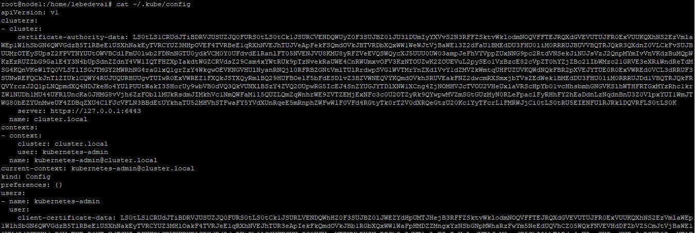
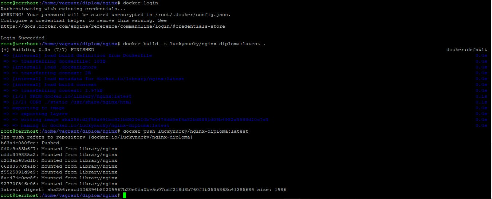
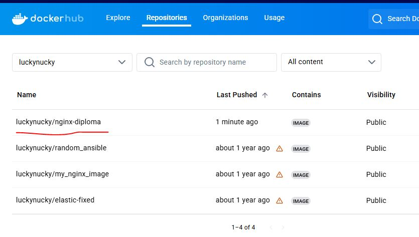

# Дипломный практикум в Yandex.Cloud. Лебедев А.И., FOPS-10
  * [Цели:](#цели)
  * [Этапы выполнения:](#этапы-выполнения)
     * [Создание облачной инфраструктуры](#создание-облачной-инфраструктуры)
     * [Создание Kubernetes кластера](#создание-kubernetes-кластера)
     * [Создание тестового приложения](#создание-тестового-приложения)
     * [Подготовка cистемы мониторинга и деплой приложения](#подготовка-cистемы-мониторинга-и-деплой-приложения)
     * [Установка и настройка CI/CD](#установка-и-настройка-cicd)
  * [Что необходимо для сдачи задания?](#что-необходимо-для-сдачи-задания)
  * [Как правильно задавать вопросы дипломному руководителю?](#как-правильно-задавать-вопросы-дипломному-руководителю)

**Перед началом работы над дипломным заданием изучите [Инструкция по экономии облачных ресурсов](https://github.com/netology-code/devops-materials/blob/master/cloudwork.MD).**

---
## Цели:

1. Подготовить облачную инфраструктуру на базе облачного провайдера Яндекс.Облако.
2. Запустить и сконфигурировать Kubernetes кластер.
3. Установить и настроить систему мониторинга.
4. Настроить и автоматизировать сборку тестового приложения с использованием Docker-контейнеров.
5. Настроить CI для автоматической сборки и тестирования.
6. Настроить CD для автоматического развёртывания приложения.

---
## Этапы выполнения:


### Создание облачной инфраструктуры

Для начала необходимо подготовить облачную инфраструктуру в ЯО при помощи [Terraform](https://www.terraform.io/).

Особенности выполнения:

- Бюджет купона ограничен, что следует иметь в виду при проектировании инфраструктуры и использовании ресурсов;
Для облачного k8s используйте региональный мастер(неотказоустойчивый). Для self-hosted k8s минимизируйте ресурсы ВМ и долю ЦПУ. В обоих вариантах используйте прерываемые ВМ для worker nodes.

Предварительная подготовка к установке и запуску Kubernetes кластера.

1. Создайте сервисный аккаунт, который будет в дальнейшем использоваться Terraform для работы с инфраструктурой с необходимыми и достаточными правами. Не стоит использовать права суперпользователя
2. Подготовьте [backend](https://www.terraform.io/docs/language/settings/backends/index.html) для Terraform:  
   а. Рекомендуемый вариант: S3 bucket в созданном ЯО аккаунте(создание бакета через TF)
   б. Альтернативный вариант:  [Terraform Cloud](https://app.terraform.io/)
3. Создайте конфигурацию Terrafrom, используя созданный бакет ранее как бекенд для хранения стейт файла. Конфигурации Terraform для создания сервисного аккаунта и бакета и основной инфраструктуры следует сохранить в разных папках.
4. Создайте VPC с подсетями в разных зонах доступности.
5. Убедитесь, что теперь вы можете выполнить команды `terraform destroy` и `terraform apply` без дополнительных ручных действий.
6. В случае использования [Terraform Cloud](https://app.terraform.io/) в качестве [backend](https://www.terraform.io/docs/language/settings/backends/index.html) убедитесь, что применение изменений успешно проходит, используя web-интерфейс Terraform cloud.

Ожидаемые результаты:

1. Terraform сконфигурирован и создание инфраструктуры посредством Terraform возможно без дополнительных ручных действий, стейт основной конфигурации сохраняется в бакете или Terraform Cloud
2. Полученная конфигурация инфраструктуры является предварительной, поэтому в ходе дальнейшего выполнения задания возможны изменения.

---
### Создание Kubernetes кластера

На этом этапе необходимо создать [Kubernetes](https://kubernetes.io/ru/docs/concepts/overview/what-is-kubernetes/) кластер на базе предварительно созданной инфраструктуры.   Требуется обеспечить доступ к ресурсам из Интернета.

Это можно сделать двумя способами:

1. Рекомендуемый вариант: самостоятельная установка Kubernetes кластера.  
   а. При помощи Terraform подготовить как минимум 3 виртуальных машины Compute Cloud для создания Kubernetes-кластера. Тип виртуальной машины следует выбрать самостоятельно с учётом требовании к производительности и стоимости. Если в дальнейшем поймете, что необходимо сменить тип инстанса, используйте Terraform для внесения изменений.  
   б. Подготовить [ansible](https://www.ansible.com/) конфигурации, можно воспользоваться, например [Kubespray](https://kubernetes.io/docs/setup/production-environment/tools/kubespray/)  
   в. Задеплоить Kubernetes на подготовленные ранее инстансы, в случае нехватки каких-либо ресурсов вы всегда можете создать их при помощи Terraform.
2. Альтернативный вариант: воспользуйтесь сервисом [Yandex Managed Service for Kubernetes](https://cloud.yandex.ru/services/managed-kubernetes)  
  а. С помощью terraform resource для [kubernetes](https://registry.terraform.io/providers/yandex-cloud/yandex/latest/docs/resources/kubernetes_cluster) создать **региональный** мастер kubernetes с размещением нод в разных 3 подсетях      
  б. С помощью terraform resource для [kubernetes node group](https://registry.terraform.io/providers/yandex-cloud/yandex/latest/docs/resources/kubernetes_node_group)
  
Ожидаемый результат:

1. Работоспособный Kubernetes кластер.
2. В файле `~/.kube/config` находятся данные для доступа к кластеру.
3. Команда `kubectl get pods --all-namespaces` отрабатывает без ошибок.

---
### Создание тестового приложения

Для перехода к следующему этапу необходимо подготовить тестовое приложение, эмулирующее основное приложение разрабатываемое вашей компанией.

Способ подготовки:

1. Рекомендуемый вариант:  
   а. Создайте отдельный git репозиторий с простым nginx конфигом, который будет отдавать статические данные.  
   б. Подготовьте Dockerfile для создания образа приложения.  
2. Альтернативный вариант:  
   а. Используйте любой другой код, главное, чтобы был самостоятельно создан Dockerfile.

Ожидаемый результат:

1. Git репозиторий с тестовым приложением и Dockerfile.
2. Регистри с собранным docker image. В качестве регистри может быть DockerHub или [Yandex Container Registry](https://cloud.yandex.ru/services/container-registry), созданный также с помощью terraform.

---
### Подготовка cистемы мониторинга и деплой приложения

Уже должны быть готовы конфигурации для автоматического создания облачной инфраструктуры и поднятия Kubernetes кластера.  
Теперь необходимо подготовить конфигурационные файлы для настройки нашего Kubernetes кластера.

Цель:
1. Задеплоить в кластер [prometheus](https://prometheus.io/), [grafana](https://grafana.com/), [alertmanager](https://github.com/prometheus/alertmanager), [экспортер](https://github.com/prometheus/node_exporter) основных метрик Kubernetes.
2. Задеплоить тестовое приложение, например, [nginx](https://www.nginx.com/) сервер отдающий статическую страницу.

Способ выполнения:
1. Воспользоваться пакетом [kube-prometheus](https://github.com/prometheus-operator/kube-prometheus), который уже включает в себя [Kubernetes оператор](https://operatorhub.io/) для [grafana](https://grafana.com/), [prometheus](https://prometheus.io/), [alertmanager](https://github.com/prometheus/alertmanager) и [node_exporter](https://github.com/prometheus/node_exporter). Альтернативный вариант - использовать набор helm чартов от [bitnami](https://github.com/bitnami/charts/tree/main/bitnami).

2. Если на первом этапе вы не воспользовались [Terraform Cloud](https://app.terraform.io/), то задеплойте и настройте в кластере [atlantis](https://www.runatlantis.io/) для отслеживания изменений инфраструктуры. Альтернативный вариант 3 задания: вместо Terraform Cloud или atlantis настройте на автоматический запуск и применение конфигурации terraform из вашего git-репозитория в выбранной вами CI-CD системе при любом комите в main ветку. Предоставьте скриншоты работы пайплайна из CI/CD системы.

Ожидаемый результат:
1. Git репозиторий с конфигурационными файлами для настройки Kubernetes.
2. Http доступ на 80 порту к web интерфейсу grafana.
3. Дашборды в grafana отображающие состояние Kubernetes кластера.
4. Http доступ на 80 порту к тестовому приложению.
---
### Установка и настройка CI/CD

Осталось настроить ci/cd систему для автоматической сборки docker image и деплоя приложения при изменении кода.

Цель:

1. Автоматическая сборка docker образа при коммите в репозиторий с тестовым приложением.
2. Автоматический деплой нового docker образа.

Можно использовать [teamcity](https://www.jetbrains.com/ru-ru/teamcity/), [jenkins](https://www.jenkins.io/), [GitLab CI](https://about.gitlab.com/stages-devops-lifecycle/continuous-integration/) или GitHub Actions.

Ожидаемый результат:

1. Интерфейс ci/cd сервиса доступен по http.
2. При любом коммите в репозиторие с тестовым приложением происходит сборка и отправка в регистр Docker образа.
3. При создании тега (например, v1.0.0) происходит сборка и отправка с соответствующим label в регистри, а также деплой соответствующего Docker образа в кластер Kubernetes.

---
## Что необходимо для сдачи задания?

1. Репозиторий с конфигурационными файлами Terraform и готовность продемонстрировать создание всех ресурсов с нуля.
2. Пример pull request с комментариями созданными atlantis'ом или снимки экрана из Terraform Cloud или вашего CI-CD-terraform pipeline.
3. Репозиторий с конфигурацией ansible, если был выбран способ создания Kubernetes кластера при помощи ansible.
4. Репозиторий с Dockerfile тестового приложения и ссылка на собранный docker image.
5. Репозиторий с конфигурацией Kubernetes кластера.
6. Ссылка на тестовое приложение и веб интерфейс Grafana с данными доступа.
7. Все репозитории рекомендуется хранить на одном ресурсе (github, gitlab)

# Выполнение:  

- Уважаемые друзья, я бы хотел сделать этот диплом идеально и у меня были ряд мыслей. Конечно же, идеально было бы создать одну машину в YC, которая бы управляла всеми установками на целевые машины, а еще лучше, завернуть это в один большой bash-скрипт. Но, жизнь вносит свои коррективы и я буду отталкиваться от того, что имею. Конструкция будет такая:

1. Машины управления (terraform, ansible, etc..) созданы локально в моем VirtualBox;
2. Я взял живые машины из предыдущих задач, но, я полагаю, все должно сработать.

- Итак, начинаем с **этапа №1**.

### Создание облачной инфраструктуры

Для начала необходимо подготовить облачную инфраструктуру в ЯО при помощи [Terraform](https://www.terraform.io/).

Особенности выполнения:

- Бюджет купона ограничен, что следует иметь в виду при проектировании инфраструктуры и использовании ресурсов;
Для облачного k8s используйте региональный мастер(неотказоустойчивый). Для self-hosted k8s минимизируйте ресурсы ВМ и долю ЦПУ. В обоих вариантах используйте прерываемые ВМ для worker nodes.

Предварительная подготовка к установке и запуску Kubernetes кластера.

1. Создайте сервисный аккаунт, который будет в дальнейшем использоваться Terraform для работы с инфраструктурой с необходимыми и достаточными правами. Не стоит использовать права суперпользователя
2. Подготовьте [backend](https://www.terraform.io/docs/language/settings/backends/index.html) для Terraform:  
   а. Рекомендуемый вариант: S3 bucket в созданном ЯО аккаунте(создание бакета через TF)
   б. Альтернативный вариант:  [Terraform Cloud](https://app.terraform.io/)
3. Создайте конфигурацию Terrafrom, используя созданный бакет ранее как бекенд для хранения стейт файла. Конфигурации Terraform для создания сервисного аккаунта и бакета и основной инфраструктуры следует сохранить в разных папках.
4. Создайте VPC с подсетями в разных зонах доступности.
5. Убедитесь, что теперь вы можете выполнить команды `terraform destroy` и `terraform apply` без дополнительных ручных действий.
6. В случае использования [Terraform Cloud](https://app.terraform.io/) в качестве [backend](https://www.terraform.io/docs/language/settings/backends/index.html) убедитесь, что применение изменений успешно проходит, используя web-интерфейс Terraform cloud.

Ожидаемые результаты:

1. Terraform сконфигурирован и создание инфраструктуры посредством Terraform возможно без дополнительных ручных действий, стейт основной конфигурации сохраняется в бакете или Terraform Cloud
2. Полученная конфигурация инфраструктуры является предварительной, поэтому в ходе дальнейшего выполнения задания возможны изменения.

## Поехали: 

- Для начала нам нужно получить ключ **yandex_iam_service_account_static_access_key** и вывести в **output** значения для подключения к S3-баккету - **s3_access_key** и **s3_secret_key**, чтобы потом внести их в наш **main.tf** (правда, пока я не решил, как я распределю создание всей инфраструктуры по ***.tf**-файлам, но, давайте смотреть.

- Для наглядности, в самом начале, создадим два файла:

- **iam_service_account_role.tf**

```
resource "yandex_resourcemanager_folder_iam_member" "sa" {
  folder_id = var.folder_id
  role      = "admin"
  member = "serviceAccount:${var.service_account_id}"
}
```

- **iam_service_account_key.tf**

```
resource "yandex_iam_service_account_static_access_key" "sa-static-key" {
  service_account_id = var.service_account_id
  description        = "static access key for object storage"
}

```

- Я воспользовался уже имеющимся у меня сервисным аккаунтом, который был создан в рамках одной из лабораторных работ и весь сенситив оставил в **terraform.tfvars**

- В данной задаче, нам нужно получить аутпут нескольких ключей, поэтому, на певом этапе **outputs.tf** будет выглядеть вот так:

```
output "s3_access_key" {
  description = "Yandex Cloud S3 access key"
  value       = yandex_iam_service_account_static_access_key.sa-static-key.access_key
  sensitive   = true
}

output "s3_secret_key" {
  description = "Yandex Cloud S3 secret key"
  value       = yandex_iam_service_account_static_access_key.sa-static-key.secret_key
  sensitive   = true
}
```

- На выходе получаем:

    

 - Отлично. Внесем значение ключей в переменные и создадим баккет -

```
resource "yandex_storage_bucket" "bucket-diplom" {
  bucket                = var.bucket_name
  folder_id             = var.folder_id
  default_storage_class = "standard"
  force_destroy         = true

  access_key = var.access_key
  secret_key = var.secret_key
}
```

 - После создания баккета добавим backend, я использовал отдельный файл backend.tf (в дальнейшем, я вывел все из main.tf и backend.tf в один файл, назвав его providers.tf):

```
terraform {
  required_providers {
    yandex = {
      source = "yandex-cloud/yandex"
    }
  }
  required_version = ">= 1.4"

  backend "s3" {
    endpoint                    = "https://storage.yandexcloud.net"
    bucket                      = "bucket-lebedevai"
    region                      = "ru-central1-b"
    key                         = "terraform.tfstate"
    access_key                  = "acces_kay_value"
    secret_key                  = "secret_key_value"
    skip_region_validation      = true
    skip_credentials_validation = true


  }
}

provider "yandex" {
  token     = var.token
  cloud_id  = var.cloud_id
  folder_id = var.folder_id
  zone      = "ru-central1-b"
}
```

- Подружить его с переменными не особо вышло, поэтому данные вносились явно. Переинициализируем терраформ и смотрим в наш баккет:

  

 - Все хорошо. Стейт-файл синхронизируется в зависимости от состояния инфраструктуры.

 - Создадим VPC с подсетями в разных зонах доступности, убедимся, что все создается, уничтожается и баккет при этом не страдает.

```
resource "yandex_vpc_network" "my_vpc" {
  name = var.VPC_name
}

resource "yandex_vpc_subnet" "public_subnet" {
  count = length(var.public_subnet_zones)
  name  = "${var.public_subnet_name}-${var.public_subnet_zones[count.index]}"
  v4_cidr_blocks = [
    cidrsubnet(var.public_v4_cidr_blocks[0], 4, count.index)
  ]
  zone       = var.public_subnet_zones[count.index]
  network_id = yandex_vpc_network.my_vpc.id
}
```

 - Переменные на текущий момент времени:

```
### main

variable "token" {
  description = "Yandex Cloud OAuth token"
  type        = string
}

variable "cloud_id" {
  description = "Yandex Cloud ID"
  type        = string
}

variable "folder_id" {
  description = "Yandex Folder ID"
  type        = string
}

variable "service_account_id" {
  description = "Yandex Service account ID"
  type    = string

}

variable "access_key" {
  description = "S3 Bucket access key"
  type    = string

}

variable "secret_key" {
  description = "S3 Bucket private key"
  type    = string

}

variable "bucket_name" {
  type = string
  default = "bucket-lebedevai"

}

### vpc

variable "VPC_name" {
  type        = string
  default     = "my-vpc"
}

### subnet

variable "public_subnet_name" {
  type        = string
  default     = "public"
}

variable "public_v4_cidr_blocks" {
  type        = list(string)
  default     = ["192.168.1.0/24"]
}

variable "subnet_zone" {
  type        = string
  default     = "ru-central1"
}

variable "public_subnet_zones" {
  type    = list(string)
  default = ["ru-central1-a", "ru-central1-b",  "ru-central1-d"]
}
```

 - Вывод outputs:

   

 - Все хорошо, после дестроя - баккет и синхронизированный с ним *.tfstate остаются в порядке.

---
### Создание Kubernetes кластера

На этом этапе необходимо создать [Kubernetes](https://kubernetes.io/ru/docs/concepts/overview/what-is-kubernetes/) кластер на базе предварительно созданной инфраструктуры.   Требуется обеспечить доступ к ресурсам из Интернета.

Это можно сделать двумя способами:

1. Рекомендуемый вариант: самостоятельная установка Kubernetes кластера.  
   а. При помощи Terraform подготовить как минимум 3 виртуальных машины Compute Cloud для создания Kubernetes-кластера. Тип виртуальной машины следует выбрать самостоятельно с учётом требовании к производительности и стоимости. Если в дальнейшем поймете, что необходимо сменить тип инстанса, используйте Terraform для внесения изменений.  
   б. Подготовить [ansible](https://www.ansible.com/) конфигурации, можно воспользоваться, например [Kubespray](https://kubernetes.io/docs/setup/production-environment/tools/kubespray/)  
   в. Задеплоить Kubernetes на подготовленные ранее инстансы, в случае нехватки каких-либо ресурсов вы всегда можете создать их при помощи Terraform.
2. Альтернативный вариант: воспользуйтесь сервисом [Yandex Managed Service for Kubernetes](https://cloud.yandex.ru/services/managed-kubernetes)  
  а. С помощью terraform resource для [kubernetes](https://registry.terraform.io/providers/yandex-cloud/yandex/latest/docs/resources/kubernetes_cluster) создать **региональный** мастер kubernetes с размещением нод в разных 3 подсетях      
  б. С помощью terraform resource для [kubernetes node group](https://registry.terraform.io/providers/yandex-cloud/yandex/latest/docs/resources/kubernetes_node_group)
  
Ожидаемый результат:

1. Работоспособный Kubernetes кластер.
2. В файле `~/.kube/config` находятся данные для доступа к кластеру.
3. Команда `kubectl get pods --all-namespaces` отрабатывает без ошибок.

## Поехали:  

- В **terraform** добавим конфигурации для одной мастер-ноды и двух воркеров:

- Добавление в **infrastructure.tf**:

```
# Topic 2

resource "yandex_compute_instance" "master-node" {
  name            = var.master_name
  platform_id     = var.platform
  zone            = var.public_subnet_zones[0]
  resources {
    cores         = var.master_core
    memory        = var.master_memory
    core_fraction = var.master_core_fraction
  }

  boot_disk {
    initialize_params {
      image_id = var.image_id
      size     = var.master_disk_size
    }
  }

  scheduling_policy {
    preemptible = var.scheduling_policy
  }

  network_interface {
    subnet_id = yandex_vpc_subnet.public_subnet[0].id
    nat       = var.nat
  }

  metadata = {
    user-data = "${file("./meta.yaml")}"

 }
}

resource "yandex_compute_instance" "worker" {
  count           = var.worker_count
  name            = "worker-node-${count.index + 1}"
  platform_id     = var.worker_platform
  zone = var.public_subnet_zones[count.index]
  resources {
    cores         = var.worker_cores
    memory        = var.worker_memory
    core_fraction = var.worker_core_fraction
  }

  boot_disk {
    initialize_params {
      image_id = var.image_id
      size     = var.worker_disk_size
    }
  }

    scheduling_policy {
    preemptible = var.scheduling_policy
  }

  network_interface {
    subnet_id = yandex_vpc_subnet.public_subnet[count.index].id
    nat       = var.nat
  }

  metadata = {
    user-data = "${file("./meta.yaml")}"

 }
}
```

- Добавление в **variables.tf**:

```
#Topic 2


variable "master_name" {
  type        = string
  default     = "control-plane"
}

variable "platform" {
  type        = string
  default     = "standard-v1"
}

variable "master_core" {
  type        = number
  default     = "4"
}

variable "master_memory" {
  type        = number
  default     = "8"
}

variable "master_core_fraction" {
  description = "guaranteed vCPU, for yandex cloud - 20, 50 or 100 "
  type        = number
  default     = "20"
}

variable "master_disk_size" {
  type        = number
  default     = "50"
}

variable "image_id" {
  type        = string
  default     = "fd893ak78u3rh37q3ekn"
}

variable "scheduling_policy" {
  type        = bool
  default     = "true"
}


### worker nodes vars

variable "worker_count" {
  type        = number
  default     = "2"
}

variable "worker_platform" {
  type        = string
  default     = "standard-v1"
}

variable "worker_cores" {
  type        = number
  default     = "4"
}

variable "worker_memory" {
  type        = number
  default     = "2"
}

variable "worker_core_fraction" {
  description = "guaranteed vCPU, for yandex cloud - 20, 50 or 100 "
  type        = number
  default     = "20"
}

variable "worker_disk_size" {
  type        = number
  default     = "50"
}

variable "nat" {
  type        = bool
  default     = "true"
}
```

- Клауд-инит файл **meta.yaml**:

```
#cloud-config
users:
  - name: lebedevai
    ssh_authorized_keys:
      - ssh-rsa MY_PUBLIC_RSA_KEY_VALUE
    sudo: ['ALL=(ALL) NOPASSWD:ALL']
    groups: sudo
    shell: /bin/bash
package_update: true
package_upgrade: true
packages:
  - nginx
  - nano
  - software-properties-common
runcmd:
  - mkdir -p /home/lebedevai/.ssh
  - chown -R lebedevai:lebedevai /home/lebedevai/.ssh
  - chmod 700 /home/lebedevai/.ssh
  - sudo add-apt-repository ppa:deadsnakes/ppa -y
  - sudo apt-get update
```

- Проверяем весь этот колхоз:

```
Apply complete! Resources: 3 added, 0 changed, 3 destroyed.

Outputs:

master_node_external_ip = "51.250.11.117"
master_node_internal_ip = "192.168.1.3"
master_node_name = "control-plane"
subnet_ids = [
  "e9b187rh2935c865tr5j",
  "e2lkvo2q32834gbotk2j",
  "fl8igk31bjj1rj4s775f",
]
subnet_ips = [
  tolist([
    "192.168.1.0/28",
  ]),
  tolist([
    "192.168.1.16/28",
  ]),
  tolist([
    "192.168.1.32/28",
  ]),
]
subnet_names = [
  "public-ru-central1-a",
  "public-ru-central1-b",
  "public-ru-central1-d",
]
subnet_zones = tolist([
  "ru-central1-a",
  "ru-central1-b",
  "ru-central1-d",
])
vpc_name = "my-vpc"
worker_nodes_external_ips = [
  "89.169.149.59",
  "89.169.163.228",
]
worker_nodes_internal_ips = [
  "192.168.1.13",
  "192.168.1.22",
]
worker_nodes_names = [
  "worker-node-1",
  "worker-node-2",
]
```

  

- Для установки Kubernetes-кластера нам потребуется рабочая машина, на которой будет **python3-pip**, **ansible** и **git**. Думаю, логично, что рабочая машина будет та же, где у нас живет и **Terraform**.

- Признаться, это было нелегко. Т.к. я использовал старую виртуальную машину с устаревшим Debian, сразу же возникли проблемы с совместимостями ansible + python3. По итогу, выбрал путь через виртуальную среду **(ansible-venv)**.

- По итогу, имеем следующий инвентарник:

```
[all]
node1 ansible_host=158.160.52.182   ansible_user=lebedevai ansible_ssh_private_key_file=/home/vagrant/diplom/ykey # ip=192.168.1.3  etcd_member_name=etcd1
node2 ansible_host=130.193.48.10  ansible_user=lebedevai ansible_ssh_private_key_file=/home/vagrant/diplom/ykey # ip=192.168.1.13 etcd_member_name=etcd2
node3 ansible_host=89.169.170.166  ansible_user=lebedevai ansible_ssh_private_key_file=/home/vagrant/diplom/ykey # ip=192.168.1.22 etcd_member_name=etcd3

[kube_control_plane]
node1

[etcd]
node1

[kube_node]
node2
node3

[calico_rr]

[k8s_cluster:children]
kube_control_plane
kube_node
calico_rr
```

- Кластер поднимался довольно долго, но, по итогу, вроде бы, все хорошо и все зеленое:

  

 - Зайдем на контрол-ноду и проверим:

     

  

 - Кластер kubernetes развернут.

---  

### Создание тестового приложения
Для перехода к следующему этапу необходимо подготовить тестовое приложение, эмулирующее основное приложение разрабатываемое вашей компанией.

Способ подготовки:

Рекомендуемый вариант:
а. Создайте отдельный git репозиторий с простым nginx конфигом, который будет отдавать статические данные.
б. Подготовьте Dockerfile для создания образа приложения.
Альтернативный вариант:
а. Используйте любой другой код, главное, чтобы был самостоятельно создан Dockerfile.
Ожидаемый результат:

Git репозиторий с тестовым приложением и Dockerfile.
Регистри с собранным docker image. В качестве регистри может быть DockerHub или Yandex Container Registry, созданный также с помощью terraform.  

## Поехали:  

- Для выполнения задачи был создан пустой новый [репозиторий](https://github.com/luckynuckywinkel/nginx)

- Репозиторий был склонирован на локальную машину, наполнен необходимыми данными (*.html, css-стили, изображение, привлекающее внимание + собственно, сам Dockerfile) и запушен обратно в ветку master.

- Проделываем все необходимое - логинимся, собираем образ, пушим на доккерхаб -

 

- Проверяем, что образ там, где нужно:

   

 ---  

### Подготовка cистемы мониторинга и деплой приложения
Уже должны быть готовы конфигурации для автоматического создания облачной инфраструктуры и поднятия Kubernetes кластера.
Теперь необходимо подготовить конфигурационные файлы для настройки нашего Kubernetes кластера.

Цель:

Задеплоить в кластер prometheus, grafana, alertmanager, экспортер основных метрик Kubernetes.
Задеплоить тестовое приложение, например, nginx сервер отдающий статическую страницу.
Способ выполнения:

Воспользоваться пакетом kube-prometheus, который уже включает в себя Kubernetes оператор для grafana, prometheus, alertmanager и node_exporter. Альтернативный вариант - использовать набор helm чартов от bitnami.

Если на первом этапе вы не воспользовались Terraform Cloud, то задеплойте и настройте в кластере atlantis для отслеживания изменений инфраструктуры. Альтернативный вариант 3 задания: вместо Terraform Cloud или atlantis настройте на автоматический запуск и применение конфигурации terraform из вашего git-репозитория в выбранной вами CI-CD системе при любом комите в main ветку. Предоставьте скриншоты работы пайплайна из CI/CD системы.

Ожидаемый результат:

Git репозиторий с конфигурационными файлами для настройки Kubernetes.
Http доступ на 80 порту к web интерфейсу grafana.
Дашборды в grafana отображающие состояние Kubernetes кластера.
Http доступ на 80 порту к тестовому приложению.  

## Поехали:  

- 


 

 
